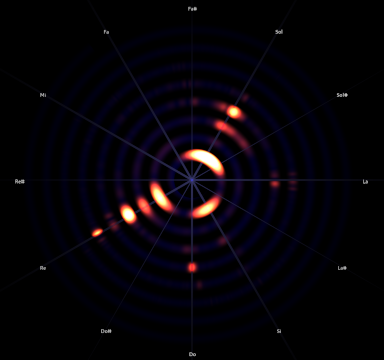

# spiralviz
## Real-time spiral spectrogram using FFTW

<p style="text-align: center;">
    <br/>
    Example spiral spectrogram playing <a href="https://nightmargin.bandcamp.com/track/ghost-in-the-machine">some music</a>
</p>

This project was inspired by [windytan's article](https://www.windytan.com/2021/11/spiral-spectrograms-and-intonation.html) on spiral spectrograms.  
The shader code is partly based on [windytan's shadertoy demo](https://www.shadertoy.com/view/ftKGRc) on the same subject.

**Disclaimer:** I am incredibly clueless about DSP and music theory, so this
project originally spawned as an attempt to be less clueless about it.

## Building

Currently, I have only tested on Linux.  
Ensure that you have fftw3 installed on your system.

```shell
mkdir build/
cd build /
cmake -G Ninja -DCMAKE_BUILD_TYPE=Release ..
cmake --build .
```

### Running

```shell
cd ../workdir/
../build/spiralviz
```

## Technical overview

### Libraries

- Audio capture is implemented using [SFML](https://www.sfml-dev.org/index.php)'s audio module (for now)
- Windowing+rendering is implemented using [SFML](https://www.sfml-dev.org/index.php) (for now)
- The debug GUI was implemented using [ImGui-SFML](https://github.com/SFML/imgui-sfml), which allow embedding [dear imgui](https://github.com/ocornut/imgui) in an SFML application
- The [discrete fourier transform (DFT)](https://en.wikipedia.org/wiki/Discrete_Fourier_transform) is computed using [FFTW](https://www.fftw.org/)